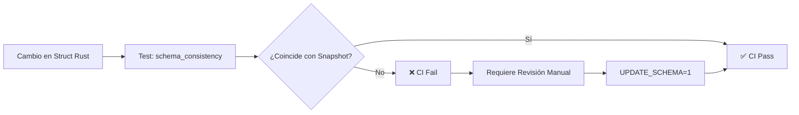

# Deuda Técnica: Arquitectura Híbrida y Automatización de Esquemas (Fase 3)

## 📋 Resumen

Este Pull Request implementa la **Fase 3** del plan de eliminación de deuda técnica. Se enfoca en dos pilares críticos para la escalabilidad del motor: **Rendimiento Gráfico** y **Estabilidad de Datos**.

Se ha desacoplado el motor de renderizado legado, introduciendo una arquitectura híbrida que prioriza la aceleración por hardware (WGPU/Vulkan/DirectX) pero mantiene una red de seguridad (Software Fallback) transparente. Además, se ha automatizado la validación de contratos de datos para prevenir regresiones en la API.

## 🔄 Tabla de Cambios

| Componente              | Antes (Legacy)                                                   | Ahora (Moderno)                                           | Beneficio                                                        |
| :---------------------- | :--------------------------------------------------------------- | :-------------------------------------------------------- | :--------------------------------------------------------------- |
| **Renderizado**         | Solo CPU (`pixels`). Lento en alta res. Atado a `lib.rs`.        | **Híbrido (GPU + CPU)**. `RenderBackend` trait abstracto. | Soporte 4K@60FPS y compatibilidad total en hardware antiguo.     |
| **Integridad de Datos** | Definición manual en Rust y Python. Propenso a desincronización. | **Automatizado (`schemars`)**. Snapshot Testing en CI.    | Garantía matemática de que Rust y Python hablan el mismo idioma. |
| **Dependencias**        | Conflictos entre `winit` y `pixels`.                             | **Resueltas**. `wgpu 0.17` alineado con ecosistema.       | Compilación limpia y estable.                                    |
| **Seguridad**           | Hashing no determinista en Assets.                               | **FnvHasher64**.                                          | Identificadores de assets estables entre ejecuciones.            |
| **API Python**          | `step()` con efectos ocultos.                                    | `StepResult` explícito.                                   | Mayor claridad y tipado fuerte para usuarios del SDK.            |

## 📐 Diagrama de Flujo: Arquitectura Híbrida

Este diagrama explica cómo el motor selecciona inteligentemente el backend de renderizado al iniciar:

```mermaid
graph TD
    A[Inicio: run_winit] --> B{¿Inicializar WGPU?}
    B -- Éxito (GPU Detectada) --> C[✅ WgpuBackend]
    C --> E[Hardware Acelerado (Vulkan/DX12)]
    B -- Error (Sin Drivers/GPU) --> D[⚠️ SoftwareBackend]
    D --> F[CPU Rasterization (Pixels)]
    E --> G[RuntimeApp Loop]
    F --> G
    G --> H{Resize/Render}
    H --> I[Backend.render()]
```

## 🛡️ Diagrama de Flujo: Validación de Esquemas



## ✅ Lista de Verificación

- [x] `cargo check --workspace` pasa sin errores.
- [x] Nuevos tests de integración para audio añadidos.
- [x] Documentación (`README.md`, `TESTING.md`) actualizada.
