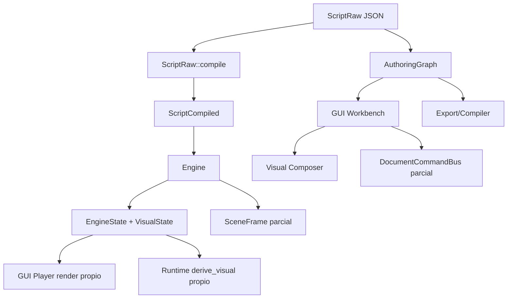
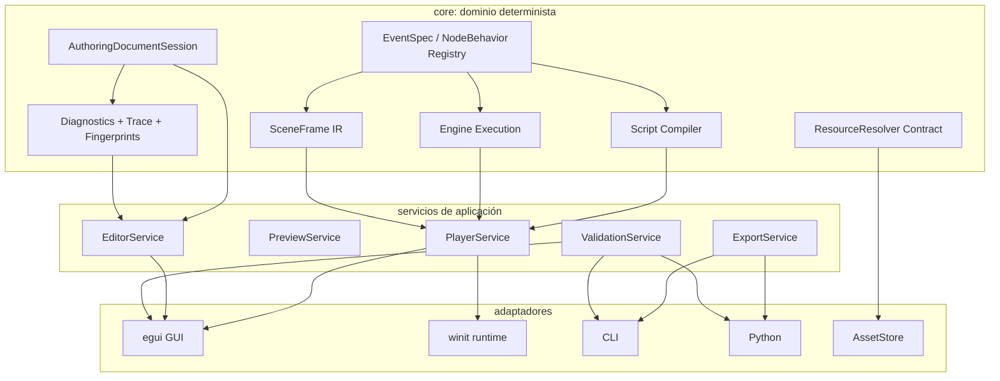
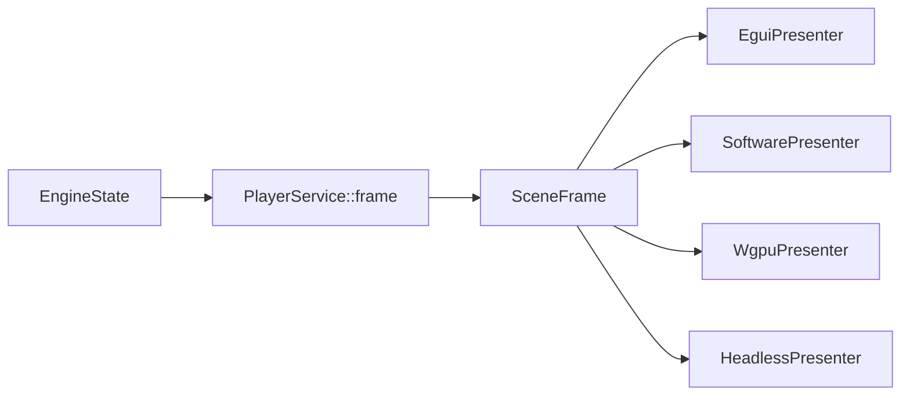

# Propuesta de arquitectura para RustNovel

Fecha: 2026-05-31  
Estado: propuesta de diseño, sin cambios de código  
Alcance: workspace completo `rustnovel-main`

## Resumen ejecutivo

RustNovel ya tiene una base más madura de lo que parece a primera vista: el `core` contiene un motor determinista, validación de authoring, contrato de exportación, huellas/fingerprints, diagnósticos, `ExecutionContract` y un `SceneFrame` que apunta a ser la representación intermedia de presentación. La debilidad principal no es ausencia de buenas ideas; es que varias de esas ideas todavía conviven con rutas paralelas en GUI, runtime, editor, CLI y Python.

El rediseño recomendado es una arquitectura de núcleo determinista con adaptadores, gobernada por contratos explícitos. El objetivo no es reescribir el motor, sino convertir las piezas correctas que ya existen en la columna vertebral obligatoria:

1. `AuthoringDocumentSession` como única frontera de mutación del editor.
2. `SceneFrame` como única representación intermedia de presentación para Player, Visual Composer, runtime exportado y pruebas headless.
3. `ExecutionContract` evolucionado a un registro de comportamiento por evento/nodo.
4. `ResourceResolver`/`AssetResolver` como frontera única de assets, paths, metadatos, presupuesto y evidencia.
5. `OperationLog`, `VerificationRun`, fingerprints y diagnósticos como trazabilidad obligatoria, no como reporte opcional.

La esencia actual se conserva: un motor de visual novel guiado por eventos, fácil de escribir en JSON, con GUI nativa, editor visual, CLI, Python bindings y exportación. Lo que cambia es la forma interna: de comportamiento distribuido por `match` y funciones específicas hacia contratos reutilizables, verificables y extensibles.

## Método de lectura

Se hizo un pase estructural del repositorio completo con índice de código y lecturas profundas de los puntos que definen arquitectura, contratos, flujo runtime, GUI, editor, recursos, exportación, API y pruebas. El índice local reportó 421 archivos, 4502 símbolos y 401 enlaces de grafo.

Archivos y zonas revisadas con mayor profundidad:

- `Cargo.toml` y los `Cargo.toml` de `crates/core`, `crates/gui`, `crates/runtime`, `crates/assets`, `crates/py` y `tools/cli`.
- `crates/core/src/lib.rs`, `engine/runtime.rs`, `event/mod.rs`, `script/raw.rs`, `script/compiled.rs`, `visual.rs`, `scene_frame.rs`, `execution_contract.rs`.
- `crates/core/src/authoring/*`, especialmente `types.rs`, `graph.rs`, `script_sync.rs`, `compiler.rs`, `command_bus.rs`, `document.rs`, `document_command_bus.rs`, `operation_log.rs`, `report_fingerprint.rs`, `validation.rs`, `diagnostics.rs`, `quick_fix.rs`.
- `crates/gui/src/app.rs`, `app/eframe_impl.rs`, `editor/workbench.rs`, `editor/workbench/ui.rs`, `editor/workbench/app_ui.rs`, `editor/workbench/operation_ops.rs`, `editor/workbench/compile_ops.rs`, `editor/node_graph.rs`, `editor/node_types.rs`, `editor/node_editor.rs`, `editor/visual_composer.rs`, `editor/scene_frame_presenter.rs`.
- `crates/runtime/src/lib.rs`, `render/backend.rs`, `render/software.rs`, `render/hardware.rs`, `render/scene_frame_presenter.rs`, `audio.rs`, `loader.rs`.
- `crates/assets/src/store.rs`, `catalog.rs`.
- `crates/py/src/lib.rs`, `python/vnengine/engine.py`.
- `crates/core/src/bundle.rs`, `bundle/spec.rs`, `bundle/plan.rs`.
- `TESTING.md`, `docs/audit/2026-03-04_refactor_generalizacion/*` y auditorías de `docs/audits/*`.

Las auditorías existentes ya apuntaban a problemas cercanos: unificar presentación, separar preview/simulación/ejecución real, centralizar resources, evolucionar `OperationLog` hacia un bus, evitar duplicación de lógica de dominio en adaptadores y mantener trazabilidad extremo a extremo. Esta propuesta toma esas conclusiones y las aterriza como diseño de arquitectura.

## Esencia que debe preservarse

RustNovel no debería convertirse en un framework genérico sin identidad. Su esencia útil es:

- Motor de visual novel basado en eventos claros: diálogo, elección, escena, salto, variables, flags, audio, transición, patch visual y llamadas externas.
- Core headless y determinista, apto para CLI, GUI, runtime exportado, Python y pruebas.
- Authoring visual como capa de edición de historia, no como una app desconectada del motor.
- JSON/script como formato mental simple para usuarios y herramientas.
- Seguridad de paths/assets y límites de recursos como parte del contrato del motor.
- Diagnósticos con evidencia, trazas y reportes reproducibles.
- Interfaz nativa pragmática: útil para crear, validar, previsualizar y exportar novelas sin exigir una pila web.

La mejora propuesta no cambia esa esencia; la hace más explícita y menos frágil.

## Caso actual

### Capas visibles

El workspace ya está separado en crates razonables:

- `crates/core`: dominio, runtime lógico, authoring, compilación, validación, exportación, trazabilidad y modelos.
- `crates/gui`: aplicación egui/eframe, player, editor, workbench, visual composer, paneles y assets GUI.
- `crates/runtime`: runtime nativo winit/pixels/wgpu/rodio.
- `crates/assets`: asset store, seguridad, cache y catálogo de fingerprints.
- `crates/py`: bindings PyO3 y API Python.
- `tools/cli`: comandos de validación, export, trace y utilidades.

Esta separación es buena. El problema está en que la responsabilidad real no siempre sigue esa frontera.

### Flujo actual simplificado



El diseño deseado ya aparece en varias piezas, pero no domina todo el flujo. El motor puede emitir `SceneFrame`, el editor tiene `AuthoringDocumentSession`, y el core tiene `ExecutionContract`; aun así, GUI y runtime reconstruyen visuales, overlays y acciones por caminos propios.

### Fortalezas actuales

1. El core contiene modelos ricos y testeables. `Engine`, `ScriptRaw`, `ScriptCompiled`, `EventRaw`, `EventCompiled`, `VisualState`, `SceneFrame` y `ExecutionContract` dan una base real.
2. La trazabilidad no es cosmética. Existen `OperationLogEntry`, `VerificationRun`, fingerprints semánticos/layout/assets/full document, diagnósticos localizados y evidencia.
3. El authoring ya tiene una dirección correcta: `AuthoringDocument`, `AuthoringDocumentSession`, `AuthoringCommandBus`, `DocumentCommand`, dirty flags, undo/redo y read model.
4. La exportación ya se acerca a un servicio profesional: plan, validación, staging, rollback, HMAC, reportes y compatibilidad.
5. Hay pruebas amplias en `crates/core/tests`, `crates/gui/tests`, `crates/runtime/tests` y `tests/python`.
6. `SceneFrame` es una abstracción muy valiosa: desacopla el estado del juego de la presentación concreta.
7. `ExecutionContract` ya expresa soporte/fidelidad/exportabilidad por evento/nodo; es una semilla excelente para generalizar comportamiento.

### Tensiones actuales

1. Hay demasiados centros de decisión para eventos y nodos. `EventRaw`, `EventCompiled` y `StoryNode` se inspeccionan por `match` en compilación, runtime, GUI, sync de script, validación, compositor, renderer y herramientas.
2. El player GUI tiene lógica específica de overlay en `app.rs`, mientras el engine también sabe producir `SceneFrame`.
3. Runtime y GUI reconstruyen estados visuales de forma parecida pero no idéntica.
4. `EditorWorkbench` concentra demasiadas responsabilidades: estado de proyecto, paneles, modo player, exportación, reportes, assets, selección, validación, operaciones, caches y preferencias.
5. El editor usa `AuthoringDocumentSession`, pero aún mantiene rutas legacy de mutación mediante graph hints y sincronizaciones manuales.
6. Assets/resources aparecen repartidos entre `crates/assets`, GUI asset cache, resource service del editor, loader del runtime y export.
7. La trazabilidad existe en core, pero no todos los cambios del GUI entran siempre por una frontera que fuerce operación, fingerprint, verificación y diagnóstico.
8. Las rutas de presentación todavía están atadas a estilos hardcodeados, textos concretos y funciones específicas.
9. El API público de `core` reexporta muchas piezas directamente, lo que vuelve difícil distinguir contrato estable de implementación.

## Reporte general por área

| Área | Lectura actual | Mejora arquitectónica recomendada |
|---|---|---|
| `crates/core` | Es el centro real del dominio. Contiene ejecución, authoring, validación, export, trazabilidad, fingerprints y contratos parciales. | Convertirlo en el dueño explícito de contratos de comportamiento, presentación, recursos y trazabilidad. Reducir reexports ambiguos y separar API estable de módulos internos. |
| `crates/core::engine` | `Engine` ejecuta eventos y actualiza estado, audio, progreso de lectura y rutas. También produce parte de la presentación. | Mantenerlo determinista y pequeño. Mover construcción de frame a `PlayerService` si crece; evitar que se contamine con GUI o decisiones de renderer. |
| `crates/core::authoring` | Tiene la base más importante para calidad futura: documento, comandos, validación, quick fixes, operation log y fingerprints. | Hacer que todo editor pase por `AuthoringDocumentSession`; convertir mutaciones GUI restantes a comandos documentales. |
| `crates/core::scene_frame` | Es el contrato correcto para desacoplar presentación, pero todavía no gobierna todas las rutas. | Promoverlo a IR obligatoria para player, composer, runtime y pruebas headless. |
| `crates/core::execution_contract` | Ya concentra soporte/fidelidad/exportabilidad. | Evolucionarlo a `EventSpec`/`NodeBehavior Registry` con capabilities, validación, preview, assets y trace. |
| `crates/gui` | Tiene valor de producto alto, pero mezcla shell, controlador, presentación, estado de documento, preview y export. | Separar shell egui, controllers y services; dejar GUI como adaptador/presenter de contratos core. |
| `crates/gui::editor` | El workbench contiene demasiada coordinación y estado persistible/transitorio mezclado. | Reducirlo de forma incremental: primero comandos documentales, luego controllers, luego vistas puras. |
| `crates/runtime` | Tiene loop nativo, backends y audio, pero conserva derivación visual propia. | Consumir `SceneFrame` y actuar como runtime adapter. La semántica del evento debe venir del core. |
| `crates/assets` | Buen punto de seguridad y fingerprints. | Subir un contrato común `ResourceResolver` para que validation, GUI, runtime y export compartan evidencia y metadata. |
| `crates/py` | Expone capacidades útiles, pero debe preservar paridad y errores estructurados. | Tratar Python como adaptador estable sobre contratos core, con fixtures compartidos y reportes versionados. |
| `tools/cli` | Es valioso para validación, trace y export automatizable. | Usar schemas compartidos para salida machine-readable; cero lógica de dominio duplicada. |
| `tests` | Hay cobertura amplia y contratos existentes. | Añadir snapshots de `SceneFrame`, registry/capabilities, paridad GUI/runtime/Python/CLI y tests de trazabilidad obligatoria. |
| `docs/audit` y `docs/audits` | Ya capturan decisiones normativas, riesgos y backlog. | Conectar esos documentos a gates ejecutables y ownership, evitando que queden como auditoría histórica. |

## Diagnóstico arquitectónico

El proyecto ya no necesita "más funciones" como primera prioridad. Necesita que cada función nueva tenga un lugar obvio donde vivir.

Hoy, añadir un evento nuevo implica pensar en demasiados puntos:

- Formato raw.
- Formato compiled.
- Compilador.
- Engine execution.
- Preview visual.
- GUI player overlay.
- Runtime renderer.
- Authoring node.
- Node palette.
- Inspector.
- Visual composer.
- Sync script <-> graph.
- Validación/lint.
- Quick fixes.
- Export support.
- Python/CLI visibility.
- Tests de paridad.

Ese costo no escala. El diseño objetivo debe hacer que añadir un comportamiento sea una operación local y trazable, no una búsqueda por todo el repo.

La enfermedad no es usar `match`: Rust lo favorece y es bueno para exhaustividad. La enfermedad es que el conocimiento de un mismo concepto está repartido sin un contrato superior. El `match` debe vivir dentro de módulos dueños del comportamiento, no en cada adaptador.

## Objetivo de arquitectura

Crear una arquitectura en la que:

1. El core define el lenguaje del motor, sus contratos, su trazabilidad y sus representaciones intermedias.
2. Las aplicaciones solo traducen entradas/salidas externas al lenguaje canónico del core.
3. GUI, runtime, CLI y Python no duplican lógica de dominio.
4. La presentación se genera una vez como `SceneFrame` y cada frontend solo la presenta.
5. Las mutaciones de authoring pasan por comandos documentales tipados.
6. Los eventos/nodos exponen comportamiento por registro o spec, no por dispersión.
7. Los assets se resuelven mediante una frontera común con seguridad, límites, metadatos y evidencia.
8. Cada operación importante deja traza reproducible.

## Arquitectura objetivo



### Regla central

Los adaptadores no deciden semántica. Traducen I/O externo hacia comandos, queries, presentaciones y reportes definidos por core.

Esto significa:

- GUI puede decidir layout de ventanas, docking y atajos.
- GUI no debería decidir qué significa un evento de diálogo, cómo se reconstruye el estado visual canónico o qué campos semánticos tiene una transición.
- Runtime puede decidir backend gráfico/audio.
- Runtime no debería tener una segunda interpretación de eventos visuales.
- Python puede ofrecer una API cómoda.
- Python no debería ocultar errores ni exponer semántica distinta.
- CLI puede serializar reportes.
- CLI no debería tener un contrato de trazas distinto al core.

## Contrato 1: EventSpec y NodeBehavior

La pieza más importante para escalabilidad es convertir `ExecutionContract` en un contrato más amplio de comportamiento.

### Caso actual

El repo ya tiene:

- `EventRaw` y `EventCompiled` como lenguaje de runtime.
- `StoryNode` como lenguaje de authoring.
- `ExecutionContract` con soporte/fidelidad/exportabilidad.
- Validadores, compiler, GUI y sync que hacen `match` por variantes.

Eso da exhaustividad, pero dispersa conocimiento.

### Objetivo

Cada tipo de evento/nodo debe declarar sus capacidades en un lugar canónico:

- Nombre estable.
- Schema de raw/compiled.
- Cómo compila.
- Cómo ejecuta.
- Cómo previsualiza.
- Cómo afecta `VisualState`.
- Cómo produce `SceneFrame` o interacciones.
- Qué assets referencia.
- Qué validaciones aporta.
- Qué quick fixes sugiere.
- Qué soporte tiene en runtime/headless/export/Python/CLI.
- Qué trazas y field paths usa.

### Forma sugerida

No hace falta empezar con macros complejas. Una fase inicial puede usar tablas y traits simples:

```rust
// Boceto conceptual, no implementación inmediata.
trait EventBehavior {
    fn kind(&self) -> EventKind;
    fn capabilities(&self) -> EventCapabilities;
    fn compile(&self, ctx: &mut CompileCtx, raw: &EventRaw) -> CompileResult<EventCompiled>;
    fn execute(&self, ctx: &mut ExecutionCtx, event: &EventCompiled) -> StepResult;
    fn preview(&self, ctx: &PreviewCtx, event: &EventRaw) -> PreviewDelta;
    fn asset_refs(&self, event: &EventRaw) -> Vec<AssetRef>;
    fn validate(&self, ctx: &ValidationCtx, event: &EventRaw) -> Vec<Diagnostic>;
}
```

Para nodos:

```rust
// Boceto conceptual.
trait NodeBehavior {
    fn node_kind(&self) -> NodeKind;
    fn ports(&self) -> PortSpec;
    fn editor_schema(&self) -> InspectorSchema;
    fn to_event(&self, node: &StoryNode) -> Result<EventRaw>;
    fn from_event(&self, event: &EventRaw) -> Option<StoryNode>;
}
```

### Por qué

Con esto, añadir un evento deja de ser una intervención quirúrgica en muchos archivos. Se vuelve:

1. Agregar spec/behavior.
2. Agregar tests de contrato.
3. Registrar UI/editor schema si aplica.
4. Verificar snapshots de capability matrix.

### Cómo migrarlo sin romper

1. Mantener los enums actuales.
2. Crear `EventKind`/`NodeKind` estable y `EventCapabilities`.
3. Extraer primero metadatos de `ExecutionContract`.
4. Mover validaciones y asset refs a behaviors por tipo.
5. Mover preview/visual del engine y runtime hacia behaviors.
6. Recién al final reducir los `match` duplicados.

## Contrato 2: SceneFrame como IR único de presentación

### Caso actual

`SceneFrame` ya existe y modela comandos de render, interacciones, tema, layout y perfil de stage. Pero el GUI player tiene rutas propias para:

- Fondo.
- Personajes.
- Diálogo.
- Choices.
- End overlay.
- Menús.
- Atajos/acciones.

Runtime también deriva visuales y presenta con backends propios. El editor tiene un `EguiSceneFramePresenter`, pero todavía no es el camino universal.

### Objetivo

`Engine` o un `PlayerService` debe producir un `SceneFrame` completo para el estado actual. GUI, runtime exportado y tests headless deben consumir ese frame.



### Qué debe contener `SceneFrame`

- Stage profile y display profile.
- Fondo y layers visuales.
- Personajes con identidad, asset, transform y z-order.
- Caja de diálogo como componente, no como función GUI especial.
- Choices como interacciones declarativas.
- Menú/player actions como `InteractionSpec`.
- Transiciones como comandos o estado temporal.
- Metadatos de trace: evento actual, node id si existe, field path y operation id.
- Theme tokens, no colores hardcodeados dispersos.

### Por qué

Esto elimina divergencia entre:

- Play mode del editor.
- Visual Composer.
- Runtime exportado.
- Headless tests.
- Potenciales frontends futuros.

También permite pruebas muy buenas: dado un script y un estado, el frame esperado puede compararse como estructura, sin depender de pixels.

### Cómo migrarlo

1. Completar `Engine::scene_frame` o crear `PlayerService::build_frame`.
2. Reemplazar gradualmente `render_dialogue_overlay`, `render_choice_overlay`, `render_scene_overlay` y equivalentes por presenter de `SceneFrame`.
3. Mantener en GUI solo la traducción egui: botones, textos, rectángulos, imágenes.
4. Agregar snapshots headless de `SceneFrame` por evento.
5. Crear una prueba de paridad: GUI play mode y runtime reciben la misma estructura de frame.

## Contrato 3: AuthoringDocumentSession como frontera única

### Caso actual

`AuthoringDocumentSession` ya es una pieza fuerte. Tiene:

- Documento.
- Undo/redo.
- Comandos registrados.
- Fingerprint cache.
- Dirty flags.
- Read model.
- Validación.
- Operation log.
- Verification runs.

Pero GUI aún mantiene `NodeGraph` con estado visual, operation hints, sincronizaciones manuales y rutas que aplican cambios fuera del documento canónico.

### Objetivo

Todo cambio semántico o persistible del editor debe entrar por:

```text
GUI Action -> DocumentCommand -> AuthoringDocumentSession::apply -> DocumentEffect
```

El GUI no debería mutar el grafo semántico como fuente de verdad. Puede mantener selección, pan, zoom, ventanas y caches visuales, pero no el documento real.

### DocumentEffect recomendado

Cada comando aplicado debería devolver un efecto explícito:

- `operation_id`
- `before_fingerprint`
- `after_fingerprint`
- `dirty_flags`
- `diagnostics_delta`
- `affected_nodes`
- `affected_assets`
- `verification_run`
- `ui_hints`

Esto evita que GUI tenga que adivinar qué refrescar.

### Por qué

La trazabilidad se vuelve automática. Undo/redo, validación, export dirty, asset dirty y layout dirty dejan de ser responsabilidad de paneles dispersos.

### Cómo migrarlo

1. Catalogar todas las acciones actuales de Workbench, Visual Composer, inspector, node editor y export wizard.
2. Clasificarlas en:
   - View-only.
   - Layout document command.
   - Semantic document command.
   - Asset/project command.
   - Export command.
3. Convertir primero las acciones semánticas de mayor riesgo: crear nodo, editar nodo, conectar, borrar, choice options, scene patch, character placement.
4. Mantener adaptadores temporales para `NodeGraph`, pero derivados desde el documento.
5. Agregar tests que fallen si una mutación semántica ocurre sin `OperationLogEntry`.

## Contrato 4: ResourceResolver único

### Caso actual

Assets y recursos viven en varias capas:

- `AssetStore` con seguridad, manifest y cache.
- `AssetFingerprintCatalog`.
- GUI asset cache.
- Editor `ResourceService`.
- Runtime `AsyncLoader`.
- Export plan y validators.

Cada pieza tiene una razón válida, pero falta una interfaz común de resolución y evidencia.

### Objetivo

Definir un contrato común:

```text
ResourceResolver
  resolve(ref, purpose) -> ResourceHandle
  metadata(ref) -> ResourceMetadata
  fingerprint(ref) -> Fingerprint
  preload(plan) -> PreloadReport
  validate(ref, policy) -> Diagnostic[]
```

Implementaciones:

- `AssetStoreResolver`
- `EditorProjectResolver`
- `RuntimePackageResolver`
- `MockResolver` para tests

### Por qué

El motor necesita saber que un asset existe, qué tipo tiene, cuánto pesa, qué fingerprint posee y qué evidencia produjo su validación. No necesita saber si viene de disco, paquete exportado, cache GUI o test fixture.

### Cómo migrarlo

1. Extraer tipos comunes: `AssetRef`, `ResourcePurpose`, `ResourceMetadata`, `ResourceEvidence`.
2. Hacer que validación/export usen ese contrato.
3. Hacer que GUI y runtime dependan de handles/caches específicos, pero alimentados por resolver común.
4. Unificar reportes de assets duplicados, presupuesto y preload plan.

## Contrato 5: trazabilidad por defecto

### Caso actual

Hay trazabilidad avanzada en core, pero todavía puede ser esquivada por rutas GUI o por adaptadores que convierten errores en strings sueltos.

### Objetivo

Cada operación de usuario relevante debe producir una cadena causal:

```text
UserAction
  -> Command
  -> OperationLogEntry
  -> FingerprintBefore/After
  -> VerificationRun
  -> Diagnostics
  -> UI Report / CLI JSON / Python Error
```

### Reglas propuestas

1. Ningún cambio semántico sin `operation_id`.
2. Ningún diagnóstico sin `trace_id`.
3. Ningún reporte exportable sin fingerprints.
4. Ningún error de adaptador convertido solo a `String` si existe envelope estructurado.
5. Ninguna prueba de GUI crítica sin verificar que se generó operación o diagnóstico.

### Por qué

La trazabilidad no es solo auditoría. Es mantenibilidad. Cuando una función falla, el código puede explicar qué cambió, por qué, desde qué acción, en qué nodo/campo/asset y con qué impacto.

## Rediseño del GUI

### Caso actual

El GUI funciona, pero el workbench concentra demasiadas responsabilidades. `EditorWorkbench` y sus módulos asociados manejan estado de aplicación, estado de documento, panels, player mode, preferencias, assets, export, quick fixes, operation logs, validation, timeline, localization y presentación.

### Objetivo

Separar el GUI en tres niveles:

```text
gui shell
  ventanas, docking, egui, input, shortcuts, layout local

controllers
  traducen acciones UI a comandos/queries
  coordinan servicios de aplicación

core services
  authoring, preview, player, validation, export, resources
```

### Módulos sugeridos

```text
crates/gui/src/
  shell/
    app.rs
    layout.rs
    shortcuts.rs
    windows.rs
  controllers/
    editor_controller.rs
    player_controller.rs
    export_controller.rs
    resource_controller.rs
  presenters/
    egui_scene_frame.rs
    diagnostics_panel.rs
    operation_log_panel.rs
  view_state/
    selection.rs
    docking.rs
    transient.rs
```

En core o una capa application:

```text
crates/core/src/application/
  player_service.rs
  preview_service.rs
  authoring_service.rs
  validation_service.rs
  export_service.rs
```

### Qué se queda en GUI

- Cómo se dibuja en egui.
- Qué ventana está abierta.
- Posición, selección, pan/zoom.
- Atajos y mapping a acciones.
- Preferencias visuales locales.
- Gestión de diálogos de archivos.

### Qué sale de GUI

- Semántica de eventos.
- Reconstrucción canónica de visual state.
- Validación de documento.
- Decisión de exportabilidad.
- Registro de operaciones.
- Fingerprints.
- Cálculo de assets referenciados.
- Lógica de preview que deba coincidir con runtime.

## Generalización de comportamientos

La generalización buscada no debería ser una abstracción vaga. Debe estar anclada a contratos y pruebas.

### Patrón actual problemático

```text
if event is Dialogue -> render dialogue overlay
if event is Choice -> render choice overlay
if node is Scene -> color scene node
if node is AudioAction -> inspector especial
```

Eso es comprensible al inicio, pero crece mal.

### Patrón objetivo

```text
event.kind -> EventBehavior
node.kind -> NodeBehavior
behavior.capabilities -> UI schema, validation, preview, export, trace
presenter -> render schema/SceneFrame, not event internals
```

### Resultado

Añadir un nuevo evento como `CameraMove`, `ShowCG`, `InventoryMutation`, `Timer`, `MacroCall` o `TimelineCue` debería requerir:

1. Definir su schema.
2. Definir su behavior.
3. Registrar capabilities.
4. Agregar tests de compile/execute/preview/export.
5. Agregar editor schema si es editable.

No debería requerir tocar manualmente player overlay, runtime visual derivation, visual composer y CLI por separado.

## Diseño algorítmico recomendado

### 1. IRs estables entre fases

Mantener fases explícitas:

```text
AuthoringDocument
  -> AuthoringGraph
  -> ScriptRaw
  -> ScriptCompiled
  -> EngineState
  -> SceneFrame
  -> Presenter-specific draw calls
```

Cada IR debe tener:

- Invariantes.
- Validación.
- Fingerprint.
- Tests de roundtrip si aplica.
- Conversión unidireccional clara.

### 2. Análisis de flujo como grafo de control

El proyecto ya tiene `StoryGraph`, route progress y dry-run. Se recomienda formalizar un CFG de script:

- Nodos: eventos compilados.
- Aristas: next, jump, choice, jump-if true/false, ext-call continuation.
- Propiedades: reachability, terminal states, cycles, branch coverage, required external host.

Usos:

- Prefetch branch-aware.
- Validación de labels.
- Route tree real.
- Coverage de dry-run.
- Detectar eventos inalcanzables.
- Explicar rutas en GUI.

### 3. Reconstrucción visual por replay determinista

Hoy saltar a una posición o previsualizar puede requerir aplicar eventos previos. La forma robusta es:

- Mantener checkpoints de `VisualState`.
- Reproducir eventos visuales desde checkpoint hasta destino.
- Invalidar checkpoints por fingerprint semántico.
- Compartir el algoritmo entre GUI, runtime y tests.

### 4. Dirty flags e incrementalidad

Los dirty flags ya existen en `AuthoringDocumentSession`. Deben gobernar caches:

- Cambio layout: no recompila script.
- Cambio texto/flow: invalida compile, validation y export runtime.
- Cambio asset ref: invalida asset validation, preload y export.
- Cambio tema: invalida SceneFrame/theme snapshots, no historia.

### 5. Fingerprints como Merkle conceptual

La separación semántico/layout/assets/full document debe mantenerse y ampliarse:

- Fingerprint por nodo.
- Fingerprint por subgrafo/fragments.
- Fingerprint por asset catalog.
- Fingerprint por export plan.

Esto permite recompilación selectiva, reportes de impacto y trazabilidad humana.

### 6. Event sourcing para authoring

El editor se beneficia de tratar comandos como fuente de verdad:

- Replay para reproducibilidad.
- Undo/redo determinista.
- Reporte causal.
- Migraciones auditables.
- Tests de comandos sin GUI.

No hace falta guardar solo eventos para el usuario final; puede guardarse snapshot + log. Pero internamente el log debe ser suficientemente completo.

## Plan incremental

### Fase 0: congelar contratos y métricas

Objetivo: impedir que la deuda siga creciendo mientras se migra.

Cambios:

- Documento de arquitectura aceptado.
- Matriz de ownership por módulo.
- Snapshot de `ExecutionContract`.
- Snapshot de `SceneFrame` para eventos base.
- Lista de mutaciones GUI que deben pasar por `DocumentCommand`.

Verificación:

- Tests existentes siguen pasando.
- Reporte estático de matches event/node usado como métrica base.
- Checklist de trazabilidad por operación.

Riesgo:

- Bajo. Es documentación + tests de caracterización.

### Fase 1: SceneFrame-first player

Objetivo: una sola fuente de presentación para play mode y runtime.

Cambios:

- Completar `PlayerService::build_frame` o equivalente.
- Hacer que GUI player consuma `SceneFrame`.
- Hacer que runtime reciba el mismo frame.
- Mantener los presenters pequeños.

Verificación:

- Snapshots headless de `SceneFrame`.
- Test de paridad GUI/runtime por script fixture.
- Test de interacciones: choice, advance, end, resume.

Riesgo:

- Medio. Es visible para usuarios, pero puede hacerse detrás de feature flag o ruta paralela temporal.

### Fase 2: DocumentCommand-first editor

Objetivo: ninguna mutación semántica sin comando documental.

Cambios:

- Convertir acciones del node editor y visual composer a `AuthoringDocumentCommand`.
- Devolver `DocumentEffect`.
- Usar dirty flags para refrescos.
- Hacer que `NodeGraph` GUI sea vista derivada o cache sincronizada.

Verificación:

- Tests de que crear/editar/conectar/borrar nodos produce operation log.
- Tests de undo/redo con fingerprint before/after.
- Tests de que layout-only no cambia fingerprint semántico.

Riesgo:

- Alto si se hace de golpe. Debe migrarse por acciones, empezando con las de mayor valor.

### Fase 3: EventSpec/NodeBehavior registry

Objetivo: reducir conocimiento duplicado de eventos/nodos.

Cambios:

- Extraer capabilities desde `ExecutionContract`.
- Añadir registry estático.
- Migrar validación y asset refs.
- Migrar preview y script sync.
- Migrar editor schema/palette.

Verificación:

- Snapshot de registry.
- Test que cada `EventRaw`/`StoryNode` tiene behavior.
- Test que cada behavior declara soporte runtime/headless/export/editor.
- Test de nuevo evento dummy en fixture interno para probar extensión.

Riesgo:

- Medio. Requiere disciplina para no crear un framework más complejo que el problema.

### Fase 4: ResourceResolver único

Objetivo: assets y recursos con contrato común.

Cambios:

- Crear tipos comunes de resource metadata/evidence.
- Conectar validation/export/runtime/gui al resolver.
- Reusar fingerprints y presupuesto de assets.
- Unificar errores de paths/assets como diagnósticos estructurados.

Verificación:

- Tests de path traversal.
- Tests de manifest requerido.
- Tests de asset faltante con evidence trace.
- Tests de package/runtime resolver.

Riesgo:

- Medio. Toca seguridad y exportación, debe hacerse con pruebas de regresión.

### Fase 5: partir Workbench en shell/controller/service

Objetivo: bajar complejidad del GUI sin cambiar producto.

Cambios:

- Extraer controllers por flujo: editor, player, export, resources.
- Mover lógica de negocio a servicios.
- Dejar `EditorWorkbench` como agregador temporal hasta poder reducirlo.
- Ordenar panels como views puras sobre state/effects.

Verificación:

- Tests GUI existentes.
- Tests de controllers sin egui donde sea posible.
- Métrica de reducción de funciones largas y matches por evento/nodo en GUI.

Riesgo:

- Medio-alto por tamaño, pero controlable si no se mezcla con cambios visuales.

### Fase 6: hardening de API pública

Objetivo: que CLI/Python/GUI hablen el mismo contrato.

Cambios:

- Reportes JSON estables.
- Errores Python estructurados.
- CLI trace con schema.
- Reexports de core agrupados por API estable y módulos internos.
- Fixtures comunes para CLI/Python/core.

Verificación:

- Snapshot de JSON report.
- Tests Python contra fixtures compartidos.
- CLI validates machine-readable.
- Semver/API review.

Riesgo:

- Medio. Puede ser breaking si se decide limpiar API pública.

## Mapa de ownership sugerido

| Área | Dueño conceptual | No debería contener |
|---|---|---|
| `core::event` | lenguaje de eventos | lógica GUI |
| `core::engine` | ejecución determinista | paths de disco, egui |
| `core::scene_frame` | IR de presentación | backend gráfico específico |
| `core::authoring` | documento, grafo, comandos, validación | estado de ventanas |
| `core::bundle` | plan/export contract | diálogos GUI |
| `assets` | resolución segura y catálogo | semántica de historia |
| `runtime` | loop nativo y backends | interpretación alternativa de eventos |
| `gui::shell` | egui, ventanas, shortcuts | reglas de dominio |
| `gui::controllers` | traducción acción -> comando/query | mutación directa de documento |
| `py` | binding estable | silenciamiento de errores |
| `cli` | UX terminal y serialización | lógica de validación duplicada |

## Criterios de aceptación

La arquitectura objetivo se puede considerar lograda cuando:

1. Un evento nuevo puede añadirse tocando un módulo de behavior, tests y schemas, sin buscar lógica duplicada por GUI/runtime/editor.
2. Player GUI, Visual Composer y runtime exportado consumen `SceneFrame` como contrato común.
3. Toda mutación semántica del editor genera `OperationLogEntry`, fingerprints before/after y dirty flags correctos.
4. Los errores de GUI/CLI/Python pueden mapearse a diagnósticos estructurados con `trace_id`.
5. Los assets se validan y resuelven por una interfaz común.
6. El número de matches dispersos sobre `EventRaw`, `EventCompiled` y `StoryNode` baja de forma medible.
7. El workbench deja de ser el centro de negocio y pasa a ser shell/controlador.
8. Las pruebas de paridad core/gui/runtime/python usan fixtures compartidos.

## Riesgos

### Riesgo 1: sobrearquitectura

La solución puede volverse demasiado abstracta si se intenta crear un plugin system completo antes de migrar casos reales.

Mitigación:

- Empezar con traits/tablas simples.
- Migrar tres eventos base primero: Dialogue, Choice, Scene.
- Medir reducción real de duplicación.

### Riesgo 2: romper comportamiento visual

Migrar a `SceneFrame` puede cambiar pequeños detalles del GUI.

Mitigación:

- Snapshot estructural antes de pixel-perfect.
- Feature flag temporal.
- Fixtures de diálogo, choice, scene patch, transition y end.

### Riesgo 3: migración larga del editor

`EditorWorkbench` está muy acoplado; una refactorización grande puede generar regresiones.

Mitigación:

- Migrar comando por comando.
- Mantener adaptador legacy temporal.
- Exigir operation log en tests para acciones migradas.

### Riesgo 4: contratos públicos

Python/CLI pueden depender de formas actuales.

Mitigación:

- Versionar reportes.
- Agregar adaptadores de compatibilidad breves.
- Documentar cambios breaking si se decide API V2.

## Stop conditions

Conviene detener una fase si:

- Una migración de GUI cambia semántica de engine.
- Un presenter empieza a decidir significado de eventos.
- Una acción semántica evita `AuthoringDocumentSession`.
- Un resolver de assets permite paths fuera del root.
- Un reporte pierde `trace_id`.
- Un test de paridad core/gui/runtime empieza a requerir excepciones manuales.

## Qué no recomiendo

1. No recomiendo una reescritura total del GUI. Hay demasiadas piezas útiles y pruebas existentes.
2. No recomiendo mover más lógica a `EditorWorkbench`.
3. No recomiendo crear un sistema de plugins dinámicos antes de tener behaviors estáticos claros.
4. No recomiendo que runtime tenga su propia semántica visual.
5. No recomiendo que CLI/Python formateen reportes sin schema compartido.
6. No recomiendo borrar código "legacy" solo por sospecha; primero debe haber contrato, test y ruta reemplazante.

## Beneficio esperado

### Calidad del código

Menos duplicación semántica, menos funciones específicas y mejores límites por módulo.

### Autoexplicabilidad

El código podrá responder "qué es este evento", "qué capabilities tiene", "cómo se presenta", "qué assets usa" y "cómo se valida" desde un contrato visible.

### Escalabilidad

Agregar funciones nuevas deja de multiplicar cambios en GUI/runtime/editor. El costo de extensión se vuelve proporcional al comportamiento nuevo, no al tamaño del repo.

### Modificabilidad

Controllers, services y presenters reducen el riesgo de tocar UI y romper dominio. Dirty flags y fingerprints ayudan a saber qué recomputar.

### Trazabilidad

Cada acción importante se vuelve auditable por diseño: acción, comando, operación, fingerprint, verificación, diagnóstico y reporte.

### GUI

El GUI deja de ser un motor paralelo y se convierte en shell/presenter de contratos core. Eso permite mejorar diseño visual sin cambiar semántica.

## Orden recomendado de trabajo

Si el equipo quiere una ruta pragmática, este sería el orden:

1. Escribir tests de caracterización de `SceneFrame` para Dialogue, Choice, Scene, Transition y End.
2. Crear `PlayerService::build_frame` como fachada estable.
3. Hacer que GUI player consuma ese frame.
4. Convertir acciones semánticas principales del editor a `AuthoringDocumentCommand`.
5. Añadir `DocumentEffect`.
6. Expandir `ExecutionContract` hacia `EventCapabilities`.
7. Crear registry estático de behaviors.
8. Migrar asset refs/validation a behaviors.
9. Unificar `ResourceResolver`.
10. Separar Workbench en shell/controllers cuando ya existan servicios confiables.

## Conclusión

RustNovel no necesita abandonar su diseño actual; necesita terminar de obedecer sus mejores ideas. El core ya contiene los fundamentos correctos: ejecución determinista, authoring command bus, documentos con fingerprints, diagnósticos, export plan, `SceneFrame` y `ExecutionContract`. La arquitectura mejor es hacer que esas piezas sean obligatorias y únicas.

La dirección recomendada es: contratos primero, adaptadores delgados, presentación unificada, mutación trazable y comportamiento registrable. Eso conserva la esencia de motor simple de visual novel, pero permite crecer con calidad de producto serio: más funciones, menos duplicación, mejores reportes, GUI más mantenible y trazabilidad real de extremo a extremo.
